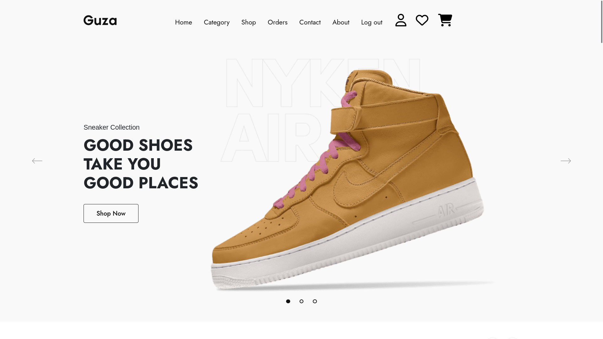
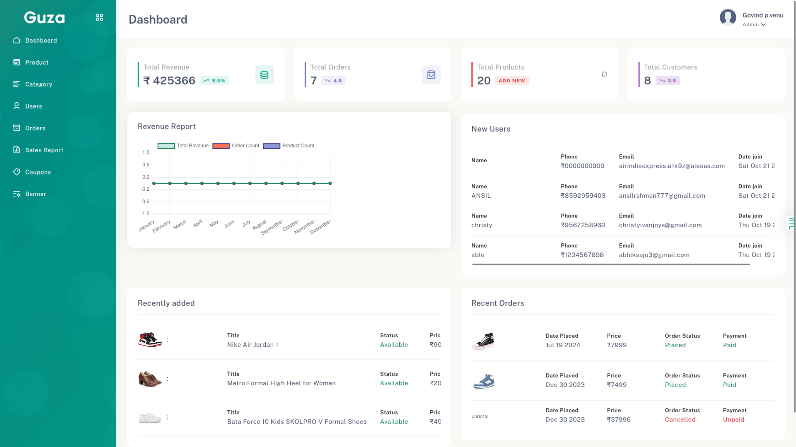

# Guza - E-commerce Platform



A full-stack e-commerce web application built with Node.js, Express, and MongoDB. This project was developed as a learning exercise to master backend development concepts including CRUD operations, authentication, payment integration, and more.

## 🌐 Live Demo

**Live Application:** [https://guza-ecommerce-project.onrender.com/](https://guza-ecommerce-project.onrender.com/)

**Admin Dashboard:** [https://guza-ecommerce-project.onrender.com/admin](https://guza-ecommerce-project.onrender.com/admin)

> **Note:** The application is deployed on Render's free tier, which means there may be a cold start delay (typically 30-60 seconds) when accessing the site after a period of inactivity. This is expected behavior for free-tier hosting.

## 🎥 Admin Dashboard Demo

Watch a complete walkthrough of the admin dashboard features:

[](https://youtu.be/H5I8_jIdNLY?t=165)

_Click the thumbnail above to watch the full demo video on YouTube_

## 📋 Project Overview

Guza is a comprehensive e-commerce platform that demonstrates proficiency in building scalable web applications using modern backend technologies. The project focuses on implementing core e-commerce functionalities while learning and applying best practices in Node.js development.

**Note:** This is a learning project, and all products displayed are dummy data for demonstration purposes.

## 🚀 Features

### User Features

-   **Authentication & Authorization**

    -   User registration with email verification (OTP)
    -   Secure login/logout functionality
    -   Session management with JWT tokens
    -   Password hashing with bcrypt

-   **Product Browsing**

    -   Product catalog with detailed views
    -   Advanced search functionality
    -   Category-based filtering
    -   Pagination for better performance
    -   Product image zoom and gallery

-   **Shopping Experience**

    -   Shopping cart management
    -   Wishlist functionality
    -   Multiple address management
    -   Order tracking and history
    -   Order cancellation

-   **Payment & Checkout**

    -   Razorpay payment integration
    -   Coupon code system
    -   Wallet system for payments
    -   Multiple payment methods

-   **User Account**
    -   Profile management
    -   Address management (add, edit, delete)
    -   Order history and details
    -   Referral system
    -   Wallet balance management

### Admin Features

-   **Dashboard**

    -   Sales reports and analytics
    -   Order management
    -   Customer management

-   **Product Management**

    -   Create, Read, Update, Delete (CRUD) operations
    -   Product image upload and optimization
    -   Category management
    -   Inventory management

-   **Content Management**
    -   Banner management
    -   Coupon creation and management
    -   Category management

## 🛠️ Tech Stack

### Backend

-   **Runtime:** Node.js
-   **Framework:** Express.js
-   **Database:** MongoDB with Mongoose ODM
-   **Authentication:** JWT, bcrypt, express-session
-   **File Upload:** Multer with Sharp (image optimization)
-   **Payment Gateway:** Razorpay
-   **Email Service:** Resend
-   **Validation:** Express-validator

### Frontend

-   **Template Engine:** EJS (Embedded JavaScript)
-   **Styling:** Custom CSS with Bootstrap components
-   **JavaScript:** Vanilla JS, jQuery
-   **UI Libraries:** SweetAlert2, DataTables, Select2

### Development Tools

-   **Environment Variables:** dotenv
-   **Development Server:** Nodemon
-   **Code Formatting:** Prettier

## 📦 Installation

1. **Clone the repository**

    ```bash
    git clone <repository-url>
    cd guza
    ```

2. **Install dependencies**

    ```bash
    npm install
    ```

3. **Set up environment variables**
   Create a `.env` file in the root directory:

    ```env
    PORT=3000
    MONGODB_URI=your_mongodb_connection_string
    SESSION_SECRET=your_session_secret
    JWT_SECRET=your_jwt_secret
    RAZORPAY_KEY_ID=your_razorpay_key_id
    RAZORPAY_KEY_SECRET=your_razorpay_key_secret
    EMAIL_USER=your_email
    EMAIL_PASS=your_email_password
    ```

4. **Run the application**

    ```bash
    # Development mode
    npm run dev

    # Production mode
    npm start
    ```

5. **Access the application**
    - User Interface: `http://localhost:3000`
    - Admin Panel: `http://localhost:3000/admin`

## 🎯 Learning Objectives

This project was built to learn and practice:

-   **CRUD Operations:** Full Create, Read, Update, Delete functionality for products, categories, orders, and users
-   **Database Design:** MongoDB schema design and relationships
-   **Authentication & Security:** JWT tokens, password hashing, session management
-   **Search & Filter:** Advanced product search and filtering mechanisms
-   **Pagination:** Efficient data pagination for large datasets
-   **Payment Integration:** Third-party payment gateway (Razorpay) integration
-   **File Upload:** Image upload, processing, and optimization
-   **Email Services:** OTP verification and transactional emails
-   **API Design:** RESTful API structure and routing
-   **Middleware:** Custom middleware for authentication and validation
-   **Error Handling:** Comprehensive error handling and validation

## 📁 Project Structure

This project follows the **MVC (Model-View-Controller)** architecture pattern:

-   **Models** (`server/models/`): Define data structures and database schemas
-   **Views** (`views/`): Handle presentation layer (EJS templates)
-   **Controllers** (`server/controllers/`): Manage business logic and handle requests

```
guza/
├── app.js                 # Main application entry point
├── server/
│   ├── config/           # Database configuration
│   ├── controllers/      # Business logic (admin & user) - Controller layer
│   ├── middleware/       # Authentication & validation middleware
│   ├── models/           # MongoDB schemas - Model layer
│   ├── routes/           # Route definitions
│   ├── utils/            # Utility functions (multer, resend, etc.)
│   └── helper/           # Helper functions
├── views/                # EJS templates - View layer
│   ├── admin/           # Admin panel views
│   ├── user/            # User-facing views
│   └── layouts/         # Layout templates
└── public/              # Static assets (CSS, JS, images)
```

## 🤝 Contributing

This is a personal learning project. However, suggestions and feedback are welcome!

## 📄 License

ISC License - See [LICENSE](LICENSE) file for details.

## 👤 Author

govindpvenu

---

**Built with ❤️ for learning Node.js, Express, and MongoDB**
